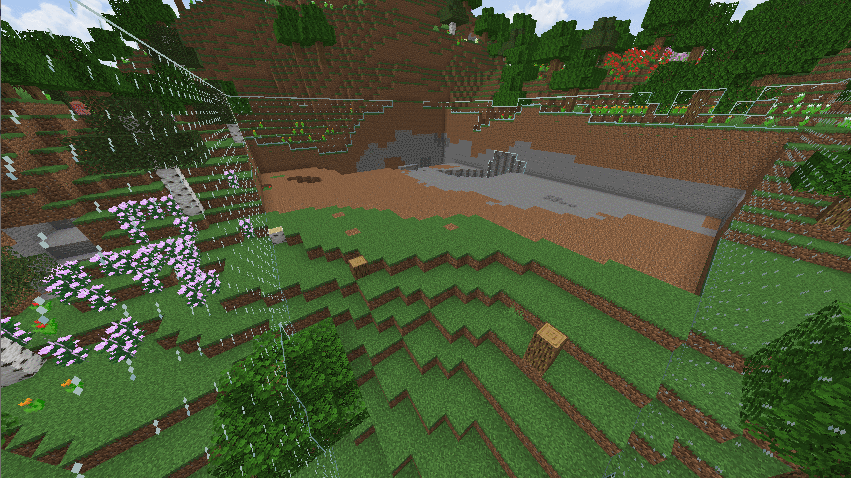
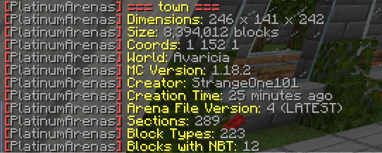

# PlatinumArenas

An arena management plugin that supports arenas of any size. Even arenas of 200 million blocks are no problem!

## Creating an arena

1. Select a region with WorldEdit (or a stick if you don't have WorldEdit)
2. Run `/arena create <name>`
3. Wait for the progress to finish!

## Resetting an arena

There are 7 different speeds you can reset arenas at: `VERYSLOW`, `SLOW`, `NORMAL`, `FAST`, `VERYFAST` and `EXTREME`. There is also an `INSTANT` speed that you will have to confirm with another command (due to the lag it can cause). If you don't provide a speed, the arena will reset at normal speed.

To reset an arena, simply do `/arena reset <arena> [speed]`. Cancel the reset with `/arena cancel`

## Showing Arena Information

Arenas can be displayed with `/arena list`. You can hover over arenas to display basic information about them, as well as click them to teleport the arenas. 

You can bring up additional information about the arena with `/arena info <arena>`

An arena's border can be toggled with `/arena border <name>`. This can allow you to see the outline of an arena's individual sections. Won't be needed for most people but useful for seeing how many sections each arena has or how large each section is.

## Permissions

- `platinumarenas` - Allows them to use any PlatinumArena commands
- `platinumarenas.create` - Allows creation of arenas
- `platinumarenas.remove` - Allows deletion of arenas
- `platinumarenas.reset` - Allows resetting of arenas
- `platinumarenas.list` - Allows usage of the arena list command
- `platinumarenas.info` - Allows more arena information to be viewed
- `platinumarenas.border` - Allows toggling the visibility of arena borders
- `platinumarenas.reload` - Allows reloading of the plugin
- `platinumarenas.reset.instant` - Allows you to use the instant speed. Has it's own permission because it's dangerous.
- `platinumarenas.debug` - Allows use of the debug command

## Requirements
- Java 8 or higher
- Spigot 1.13 or higher

Compatible with 1.18/1.19. WorldEdit is not required.
