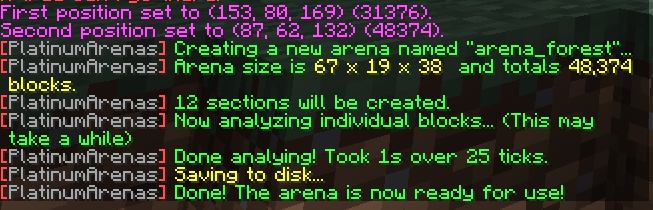
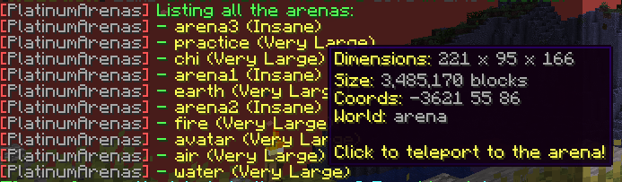
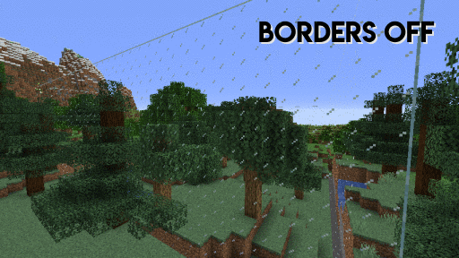

# PlatinumArenas

An arena management plugin that supports arenas of any size. Even arenas of 200 million blocks are no problem! Currently requires WorldEdit to create arenas.

## Creating an arena

1. Select a region with WorldEdit
2. Run `/arena create <name>`
3. Wait for the progress to finish!

## Resetting an arena

There are 7 different speeds you can reset arenas at. These will soon be configurable. `VERYSLOW`, `SLOW`, `NORMAL`, `FAST`, `VERYFAST` and `EXTREME`. There is also an `INSTANT` speed that you will have to confirm with another command. If you don't provide a speed, the arena will reset at normal speed.

If the arena is resetting too slow or too fast for your liking, you can cancel the reset with `/arena cancel` and try again with a different speed.

To reset an arena, simply do `/arena reset <arena> [speed]`

## Showing Arena Information

Arenas and their infomation can be dispalyed with `/arena list`. You can hover over arenas to display their stats, as well as TP to the arenas. Note: You must be in the same world as said arena for this to work (TP commands cannot teleport you to another world when teleporting to coordinates)

An arena's border can be toggled with `/arena border <name>`. This can allow you to see the outline of an arena's individual sections. Won't be needed for most people but useful for seeing how many sections each arena has or how large each section is.

## Permissions

- `platinumarenas` - Allows them to use any PlatinumArena commands
- `platinumarenas.create` - Allows creation of arenas
- `platinumarenas.remove` - Allows deletion of arenas
- `platinumarenas.reset` - Allows resetting of arenas
- `platinumarenas.list` - Allows usage of the arena list command
- `platinumarenas.border` - Allows toggling the visibility of arena borders
- `platinumarenas.reset.instant` - Allows you to use the instant speed. Has it's own permission because it's dangerous.
